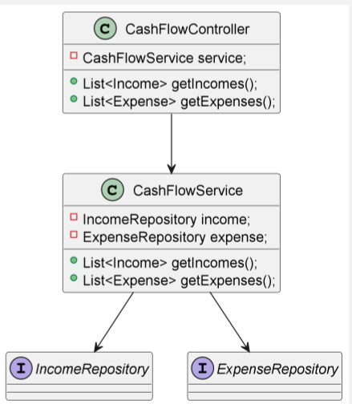
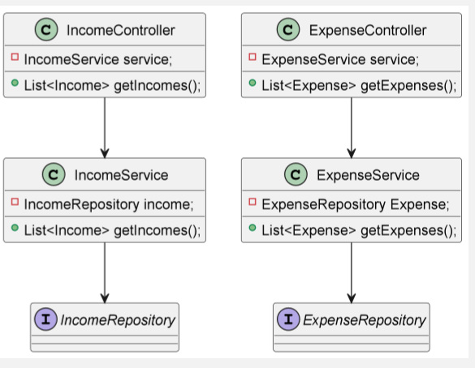
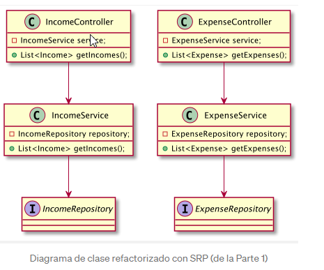

# principios-solid-spring-boot

```text
https://medium.com/geekculture/how-to-apply-solid-software-design-principles-to-spring-boot-application-part-1-6b886f6d943e
```

## SOLID
*  SRP: Single Responsibility Principle 
*  OCP: Open-Closed Principle
*  LSP: Liskov Substitution Principle 
*  ISP: Interface Segregation Principle 
*  DIP: Dependency Inversion Principle


### SPR (Single Responsibility Principle)

**_Un módulo debe ser responsable ante uno y solo un actor (Robert C. Martín)_**

SRP establece de acuerdo en el mundo Java, cada clase debe ser responsable 
de hacer una cosa, en consecuencia, debe cambiar solo por una razón. <br>
Aislar las clases en función de su área de responsabilidad aumenta el desacoplamiento.

**_El desacoplamiento es: dos o más sistemas de alguna manera funcionan o están conectados
sin estar conectados directamente._**

La clase que es responsable de una sola funcionalidad es fácil de entender,
probar y mantener. Por "hacer una cosa" no se quiere decir que esta clase 
deba hacer literalmente una cosa. La clase puede realizar múltiples tareas
y tener numerosos métodos (No demasiados) pero al final del día, todos estos
deberían servir para un actor/stakeholder/use case/funcionalidad etc.

Este tipo de clase altamente cohesiva elimina dos problemas potenciales
en el desarrollo de software diario:

* Evitar duplicados
* Disminución de los conflictos de fusión

**_Cohesión es el grado en que los elementos de un determinado módulo pertenecen juntos._**

Ejemplo:

Una aplicación de gestión de flujo de caja (cash flow) donde solo muestra una lista de 
ingresos y gastos.


Se manejarán diferentes ramas por cada patron Solid:

SPR
* feature/srp-initial (base inicial del proyecto)
* feature/spr-refactored ( refactorizando aplicando SPR)


| SPR Initial                                                            | SPR Refactored                                                         |
|------------------------------------------------------------------------|------------------------------------------------------------------------|
|  |  |


### OCP (Open-Closed Principle)

**_Un artefacto de software debe estar abierto para extensión pero cerrado para modificación_**

Esta simple descripción del principio fue introducida por primera vez por **Bertrand Meyer**.
El sistema de software que necesita modificaciones cada vez para cualquier funcionalidad adicional es
simplemente un gran desastre. Por otro lado, este tipo de programa caótico recibe errores ocasionales
cada vez que se realiza una modificación. Preferiblemente, cada nueva funcionalidad debe tener el
máximo de código nuevo y el mínimo de cambios en el código antiguo, en un mundo ideal:
_cero cambios en el código antiguo._

Desde el punto de vista de la arquitectura, antes de estructurar cualquier sistema de software,
cada desarrollador debe pensar cuidadosamente que componentes deben estar libres de cambios y organizar
el flujo de dependencia para que los componentes importantes (complementos, paquetes, clases..) no necesiten
cambios cuando los componentes menos importantes son los que en verdad necesitan un cambio.
Por lo tanto, el flujo de dependencia de un software debe dirigirse a los componentes que más desea proteger.


**_Si el componente A debe protegerse de los cambios en el componente B, entonces el componente B debe aprender
del componente A y no de otra manera._**

Afortunadamente, las capacidades de la programación orientada a objetos son capaces de manejar este
tipo de problemas. **El polimorfismo, mediante el uso de clases super/child y la IoC (inversion of control),
mediante el uso de interfaces (en términos Java)** Son dos técnicas poderosas que podemos usar para
lograr el principio Open/closed.

> Polimorfismo significa "muchas formas" y ocurre cuando tenemos muchas clases que estan relacionadas 
> entre sí por herencia. <br>
> La Inversión de control (IoC) es invertir el flujo de control en comparación con el flujo 
> de control tradicional.


Si recordamos nuestra aplicación de gestión de flujo de efectivo (cashflow), podemos ver que el flujo de
dependencia es en una dirección: de la vista a la Base de datos.<br>
En el centro de la aplicación, hay clases de servicio que contienen la lógica comercial principal.<br>
Los controladores están inyectando Servicios, pero no de otra manera.<br>
Entonces: los cambios en los controladores no afectarán a los servicios.
Con este tipo de vinculación unidireccional, hicimos que nuestros servicios fueran algo
resistentes a los cambios en los controladores, lo cual es un efecto positivo con respecto a OCP.




Pero llevemos esta idea un paso más allá y agreguemos otra capa de abstracción entre controladores 
y servicios. Por ahora, los cambios en los servicios afectarán a los controladores pero al aplicar 
IoC (inversion de control), transformamos los servicios en interfaces con métodos abstractos 
y permitimos que sean implementados por las clases **ServiceImpl** que son verdaderos implementadores
de la lógica comercial y en consecuencia, aíslan la lógica comercial de los servicios de 
los controladores.<br>
Con esto también conseguimos ocultar información: ocultar los _Servicios_ a los _controladores_ y
así evitar dependencias transitivas.

> Las dependencias transitivas son una violación del principio general de que las entidades
> de software no deben depender de cosas que no usan directamente.

También estamos trasladando todos los módulos relacionados con la lógica empresarial al paquete
"cashflow.core.*". Con todo esto en mente, echemos un vistazo al diagrama de clases refactorizado
de la gestión del flujo de cajas. En aras de la exhaustividad, las entidades se amplían con nuevas
columnas junto con otras operaciones CRUD.


## Docker

### Mysql

```shell
docker run -d -p 3306:3306  --name mysql-db -e MYSQL_ROOT_PASSWORD=cpalomino2022*** mysql 
```