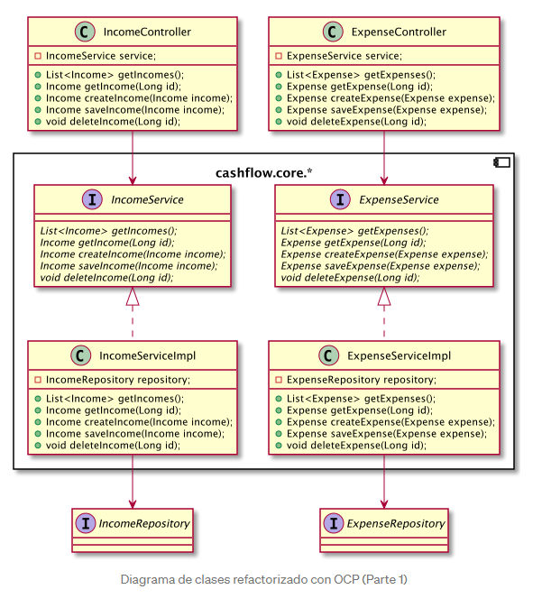
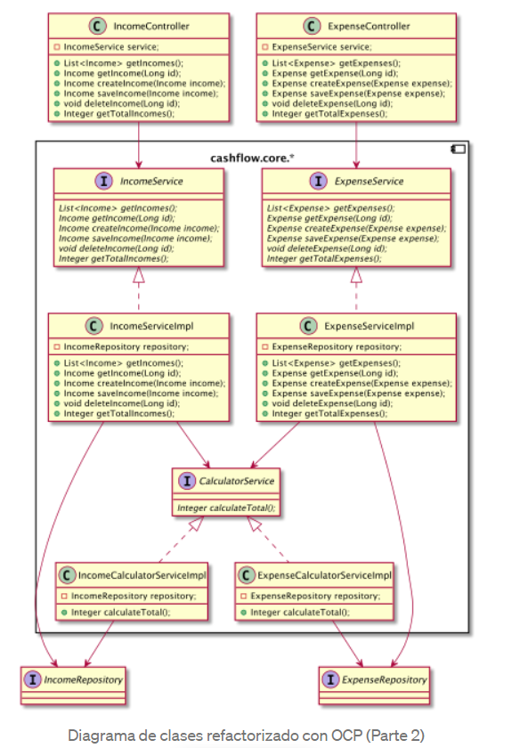
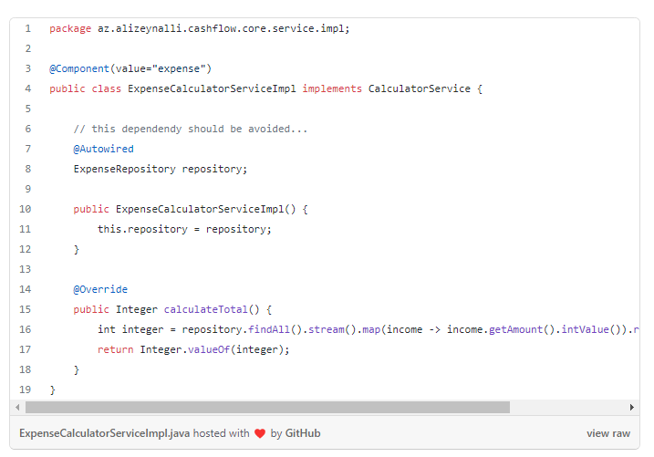
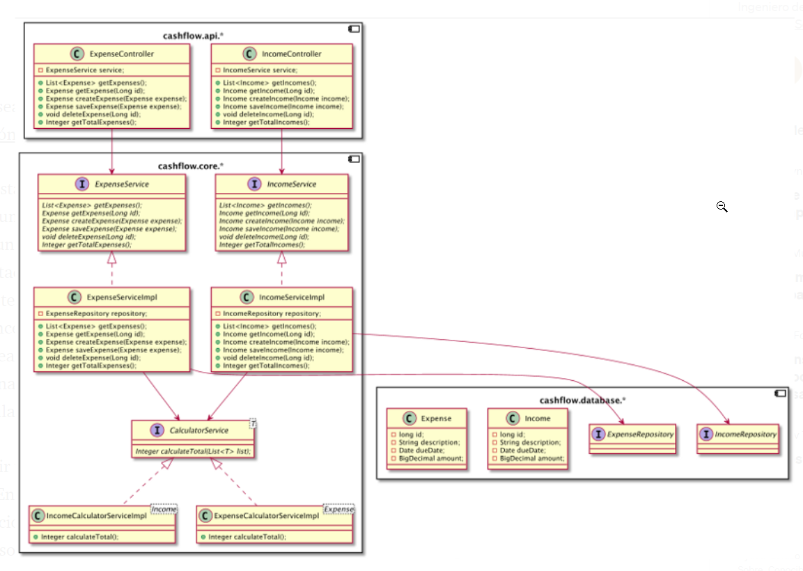
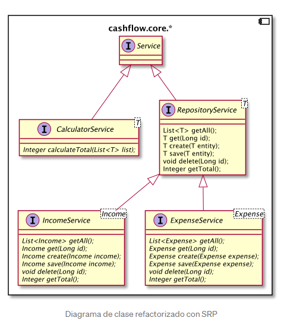
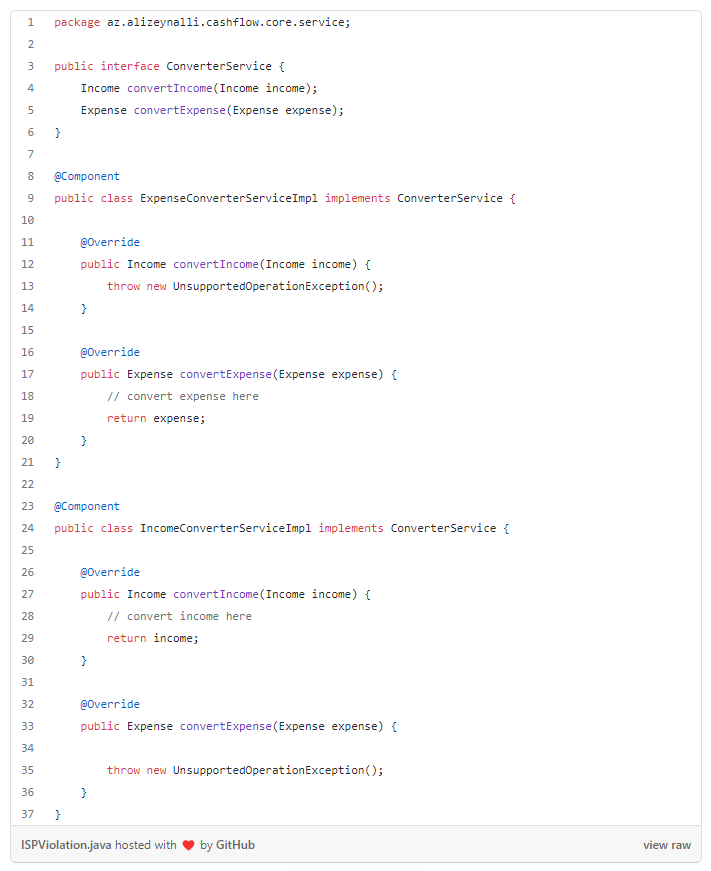
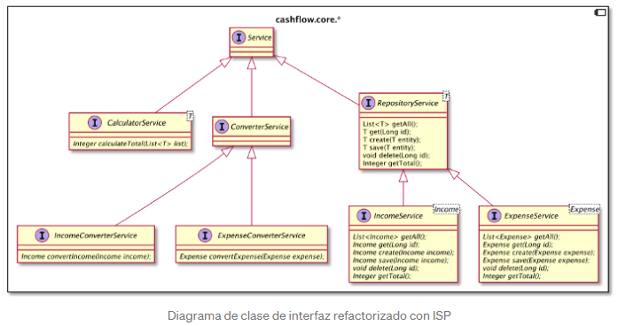

# principios-solid-spring-boot

```text
https://medium.com/geekculture/how-to-apply-solid-software-design-principles-to-spring-boot-application-part-1-6b886f6d943e
```

## SOLID
*  SRP: Single Responsibility Principle 
*  OCP: Open-Closed Principle
*  LSP: Liskov Substitution Principle 
*  ISP: Interface Segregation Principle 
*  DIP: Dependency Inversion Principle


### SPR (Single Responsibility Principle)

**_Un módulo debe ser responsable ante uno y solo un actor (Robert C. Martín)_**

SRP establece de acuerdo en el mundo Java, cada clase debe ser responsable 
de hacer una cosa, en consecuencia, debe cambiar solo por una razón. <br>
Aislar las clases en función de su área de responsabilidad aumenta el desacoplamiento.

**_El desacoplamiento es: dos o más sistemas de alguna manera funcionan o están conectados
sin estar conectados directamente._**

La clase que es responsable de una sola funcionalidad es fácil de entender,
probar y mantener. Por "hacer una cosa" no se quiere decir que esta clase 
deba hacer literalmente una cosa. La clase puede realizar múltiples tareas
y tener numerosos métodos (No demasiados) pero al final del día, todos estos
deberían servir para un actor/stakeholder/use case/funcionalidad etc.

Este tipo de clase altamente cohesiva elimina dos problemas potenciales
en el desarrollo de software diario:

* Evitar duplicados
* Disminución de los conflictos de fusión

**_Cohesión es el grado en que los elementos de un determinado módulo pertenecen juntos._**

Ejemplo:

Una aplicación de gestión de flujo de caja (cash flow) donde solo muestra una lista de 
ingresos y gastos.


Se manejarán diferentes ramas por cada patron Solid:

SPR
* feature/srp-initial (base inicial del proyecto)
* feature/spr-refactored ( refactorizando aplicando SPR)


| SPR Initial                                                            | SPR Refactored                                                         |
|------------------------------------------------------------------------|------------------------------------------------------------------------|
|  |  |


### OCP (Open-Closed Principle)

**_Un artefacto de software debe estar abierto para extensión pero cerrado para modificación_**

Esta simple descripción del principio fue introducida por primera vez por **Bertrand Meyer**.
El sistema de software que necesita modificaciones cada vez para cualquier funcionalidad adicional es
simplemente un gran desastre. Por otro lado, este tipo de programa caótico recibe errores ocasionales
cada vez que se realiza una modificación. Preferiblemente, cada nueva funcionalidad debe tener el
máximo de código nuevo y el mínimo de cambios en el código antiguo, en un mundo ideal:
_cero cambios en el código antiguo._

Desde el punto de vista de la arquitectura, antes de estructurar cualquier sistema de software,
cada desarrollador debe pensar cuidadosamente que componentes deben estar libres de cambios y organizar
el flujo de dependencia para que los componentes importantes (complementos, paquetes, clases..) no necesiten
cambios cuando los componentes menos importantes son los que en verdad necesitan un cambio.
Por lo tanto, el flujo de dependencia de un software debe dirigirse a los componentes que más desea proteger.


**_Si el componente A debe protegerse de los cambios en el componente B, entonces el componente B debe aprender
del componente A y no de otra manera._**

Afortunadamente, las capacidades de la programación orientada a objetos son capaces de manejar este
tipo de problemas. **El polimorfismo, mediante el uso de clases super/child y la IoC (inversion of control),
mediante el uso de interfaces (en términos Java)** Son dos técnicas poderosas que podemos usar para
lograr el principio Open/closed.

> Polimorfismo significa "muchas formas" y ocurre cuando tenemos muchas clases que estan relacionadas 
> entre sí por herencia. <br>
> La Inversión de control (IoC) es invertir el flujo de control en comparación con el flujo 
> de control tradicional.


Si recordamos nuestra aplicación de gestión de flujo de efectivo (cashflow), podemos ver que el flujo de
dependencia es en una dirección: de la vista a la Base de datos.<br>
En el centro de la aplicación, hay clases de servicio que contienen la lógica comercial principal.<br>
Los controladores están inyectando Servicios, pero no de otra manera.<br>
Entonces: los cambios en los controladores no afectarán a los servicios.
Con este tipo de vinculación unidireccional, hicimos que nuestros servicios fueran algo
resistentes a los cambios en los controladores, lo cual es un efecto positivo con respecto a OCP.


Pero llevemos esta idea un paso más allá y agreguemos otra capa de abstracción entre controladores 
y servicios. Por ahora, los cambios en los servicios afectarán a los controladores pero al aplicar 
IoC (inversion de control), transformamos los servicios en interfaces con métodos abstractos 
y permitimos que sean implementados por las clases **ServiceImpl** que son verdaderos implementadores
de la lógica comercial y en consecuencia, aíslan la lógica comercial de los servicios de 
los controladores.<br>
Con esto también conseguimos ocultar información: ocultar los _Servicios_ a los _controladores_ y
así evitar dependencias transitivas.

> Las dependencias transitivas son una violación del principio general de que las entidades
> de software no deben depender de cosas que no usan directamente.

También estamos trasladando todos los módulos relacionados con la lógica empresarial al paquete
"cashflow.core.*". Con todo esto en mente, echemos un vistazo al diagrama de clases refactorizado
de la gestión del flujo de cajas. En aras de la exhaustividad, las entidades se amplían con nuevas
columnas junto con otras operaciones CRUD.



- feature/ocp-refactored-step-1: rama donde se tiene la primera etapa donde se aplica ocp

El ejemplo para "ocp-refactored-step-1" fue un gran toque arquitectónico para la aplicación.<br>
Pero echemos un vistazo a un ejemplo más con más contexto de bajo nivel.
Por lo tanto, **existe la necesidad de una nueva funcionalidad** en la que se debe 
**calcular la cantidad total de ingresos y gastos** <br/> <br/>
Por supuesto, el cálculo central se puede realizar en las clases de ServiceImpl, pero no sería un paso
inteligente, ya que modificaríamos nuestra lógica comercial ((business logic)) en lugar de extenderla.<br>

- feature/ocp-refactored-step-2: rama donde se tiene la última etapa donde se aplica ocp 
para atender una nueva funcionalidad.


Por lo tanto, la forma correcta de implementar esta funcionalidad mediante la ampliación de la gestión
del flujo de efectivo (cashflow) **es crear un nuevo CalculatorService** que también manejará en el 
futuro todo tipo de cálculos y dejar que diferentes implementaciones de casos de uso lleven el código
para el cálculo (consulte las clases IncomeCalculatorServiceImpl y ExpenseCalculatorServiceImpl)<br><br>
Entonces, si mañana necesitamos un nuevo caso de uso para calcular la cantidad total, 
no modificaremos nuestra lógica comercial (business logic), sino que agregaremos una nueva clase de
implementación más.Para cambiar diferentes implementaciones del cálculo, las anotaciones @Qualifer 
y @Component se utilizan en Spring Framework Context.




### LSP (Liskov Substitution Principle)

> Si para cada objeto o1 del tipo S hay un objeto o2 de tipo T tal que para todos los programas P
> definidos en términos de T, el comportamiento de P no cambia cuando se sustituye o2 por o1, entonces
> S es un subtipo de T

Esta definición de Barbara Liskov puede sonar bastante confusa pero, en esencia, es un principio
simple y fácil de entender. Si reafirmamos la definición anterior, el lema del principio es: <br>
> cuando se utiliza la herencia, la jerarquía de la herencia debe ser coherente desde el punto de
> de vista funcional y de la lógica comercial (business logic). <br>
> Los subtipos deben ser mutuamente sustituibles y no alterar el comportamiento de la clase principal.

Como un ejemplo simple, podemos tomar el problema del "cuadrado/rectángulo". Donde el cuadrado no debe
ser un subtipo de rectángulo, porque la definición de altura y longitud de estas dos formas geométricas
es diferente ( la altura y el peso del cuadrado son iguales, mientras que para el rectángulo variaran).

Algunos puntos importantes a tener cuenta al construir la herencia para cumplir con LSP son:
1. Mantenga las superclases lo más simple y abstractas que pueda, para que luego pueda ampliar
   la funcionalidad sin alterar el comportamiento del objeto principal.
2. Piénselo dos veces cuando construya relaciones padre-hijo para no tener jerarquías desordenadas
   y si las clases secundarias son mutuamente sustituibles.
3. El principio de los "4 ojos" es vital para diseñar la estructura del sistema de software, ya que
   el diseño orientado a objetos puede ser, por un lado, poderoso pero también muy confuso.

Así que echemos un vistazo a nuestra aplicación de gestión de flujo de efectivo e intentemos ampliar
la funcionalidad de la aplicación mientras mantenemos el código fuente dentro de los límites del LSP.

Para un ejemplo de LSP, vamos a modificar nuestra aplicación de gestión de flujo de efectivo
inicialmente para adaptarla para una mayor refactorización de LSP.<br>
- Como primer paso, vamos a refactorizar las clases de implementación CalculatorService
- Suponemos que CalculatorService solo debe ser responsable del cálculo matemático.
- Y todas las operaciones CRUD se realizan a través de los Servicios de IncomeService y ExpenseService.

Entonces, con esa mente, no es necesario que las clases de implementación de la interfaz CalculatorService
inyecten repositorios y tengan una conexión indirecta con la base de datos a través de las especificaciones
JPA.



- Eliminaremos estas interfaces de repositorio y entregaremos esa información a través de los servicios
IncomeService y ExpenseService, que solo son elegibles para conectarse a la Base de datos.
- Por otro lado estamos aislando diferentes clases en diferentes paquetes según su área de
responsabilidad bajo tres paquetes principales: "api", "core" y "database".
- **el paquete cashflow.api.** es responsable de la conexión con la vista frontal.
- **el paquete cashflow.core.** es la parte principal de la aplicación de gestión de flujo (cashflow) 
en efectivo, como sabrá por los pasos anteriores, donde tenemos la lógica comercial principal.
- **el paquete cashflow.database.** incluye las clases e interfaces que estan vinculadas a las 
actividades de la base de datos.



- feature/lsp-refactored-step-1: Base inicial del proyecto para aplicar LSP.
- feature/lsp-refactored-step-2: Cambios aplicando lsp

Nos estamos moviendo ahora para estructurar nuestras interfaces de una manera que cumpla con LSP.<br>
- Todas las interfaces del paquete cashflow.core.* se reunirán bajo un mismo paquete
- IncomeService, ExpenseService que son inyectados por los Controllers y responsables de las 
operaciones CRUD.
- CalculatorService que es solo para cálculos matemáticos.

Entonces, semánticamente, estos dos grupos de interfaz son diferentes, ya sea que sean elegibles
para realizar operaciones CRUD o no. Recuerde que eliminamos las interfaces de repositorio JPA
de las implementaciones de CalculatorService.

Reunir todas estas interfaces bajo una interfaz abstracta sería una violación de LSP. <br>
Entonces, lo que podemos hacer aquí es tener una interfaz maestra que sea Servicio, otra interfaz
de repositorio debe extender este servicio y el servicio de IncomeService y ExpenseService también
extienden el servicio de Repositorio (RepositoryService). <br>

CalculationService extendera directamente la interfaz de servicio. Dado que los métodos en
IncomeService y ExpenseService son idénticos además de los tipos de datos de 
ingresos y resultados, podemos usar genéricos de Java para acumularlos todos en RepositoryService.

Como puede ver, los subtipos de RepositoryService son mutuamente sustituibles y semánticamente iguales.
Pero CalculatorService está asignado para realizar tareas completamente diferentes, por lo que no seria
el hermano correcto para los servicios de ingresos y gastos.





### ISP (Interface Segregation Principle)

> El principio de segregación de interfaces establece que ningún cliente debe verse obligado a
> depender de métodos que no utiliza.

Antes incluso de comenzar a explicar cuáles son las ideas de este principio, debemos dejar en claro
que este principio se aplica principalmente a lenguajes de programación de tipado estático 
(Statically-typed language) como Java, C, etc. 
En lenguajes de tipado dinámico (Dynamically-typed language) como Python o Ruby, este principio no hace un gran sentido.

> **Statically-typed language** se puede referir a los lenguajes donde el tipo de variables se conoce
> en el momento de la compilación.<br>
> **Dynamically-typed language** mientras que se ejecuta muchos comportamientos de programación
> comunes en tiempo de ejecución.

Según este principio, los componentes de software(complementos, paquetes, clases, etc) no deberían 
tener dependencias que no utilicen. Afortunadamente, en casi todos los IDE modernos como eclipse o
Intellij, hay una función de "Organizar importaciones" que eliminará las importaciones no utilizadas,
pero el problema no es tan trivial.

- feature/isp-refactored-step-1: 

Entonces, si echamos un vistazo a nuestra "querida" aplicación de gestión de flujo de efectivo 
(cash flow management application) , podemos imaginar una situación en la que nuestros casos de uso
de ingresos y gastos dependan de una funcionalidad que tiene lógica comercial para ambos casos. <br>
Por lo tanto, el caso de uso de ingresos tiene una gran dependencia de una funcionalidad que se usa
para el caso de uso de gastos y el caso de uso de gastos tiene el mismo problema con respecto al
caso de uso de ingresos.

La siguiente es la violación de ISP basada en la discusión anterior:




- feature/isp-refactored-step-2

Dado que IncomeConverterServiceImpl y ExpenseConverterServiceImpl deben implementar métodos no 
utilizados, lanzamos Exception para detectar esos casos, pero tendría sentido si los aislamos.<br> 
Por lo tanto, cualquier  cambio en el método convertExpense() generará errores de compilación y
la necesidad de un cambio en IncomeConverterServiceImpl, que incluso no necesita ese método.

A continuación se muestra el diagrama de clases de interfaces refactorizado basado en el principio de 
segregación de interfaces en el paquete cashflow.core.*:



Básicamente, lo que hicimos aquí fue dividir ConverterServices en casos de uso y permitirles
extender la interfaz de servicio abstracta. 

Para nuestro ejemplo, puede que no sea la mejor solución, ya que solo tenemos un método 
para implementar para cada caso de uso. Pero imagine una situación en la que tiene muchas interfaces
que se implementan varias veces para diferentes contextos. Va ser un gran lío no?

En realidad, se trata de ISP: divida los módulos en módulos más pequeñps para evitar dependencias
no utilizadas.


## Docker

### Mysql

```shell
docker run -d -p 3306:3306  --name mysql-db -e MYSQL_ROOT_PASSWORD=cpalomino2022*** mysql 
```